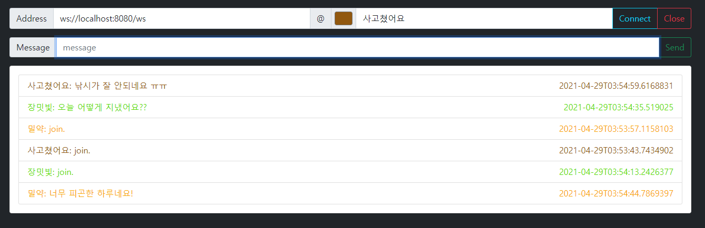

# Chat Service

## 개요
- Spring Boot 의 WebSocket EventListener 및 Annotation 을 이용하여 mvc 형태로 사용하는 구조 생성
- svelte 를 이용하여 간단한 클라이언트 생성

## 사용 기술
- JDK: 11
- Language: Kotlin
- Framework: Spring Boot

## Client 샘플


## 빌드 방법

### Windows
- `Build`
```
gradlew build
```

- `Run`
```
java -jar build\libs\chat-service-portfolio-0.0.1-SNAPSHOT.jar
```

### Linux or Mac
- `Build`
```
./gradlew build
```

- `Run`
```
java -jar build/libs/chat-service-portfolio-0.0.1-SNAPSHOT.jar
```


## frontend
- Language: Javascript
- Framework: Svelte

- `Build`
```
cd chat-service-client
npm install
npm run-script build
```

- `Run`
```
public/index.html
```
